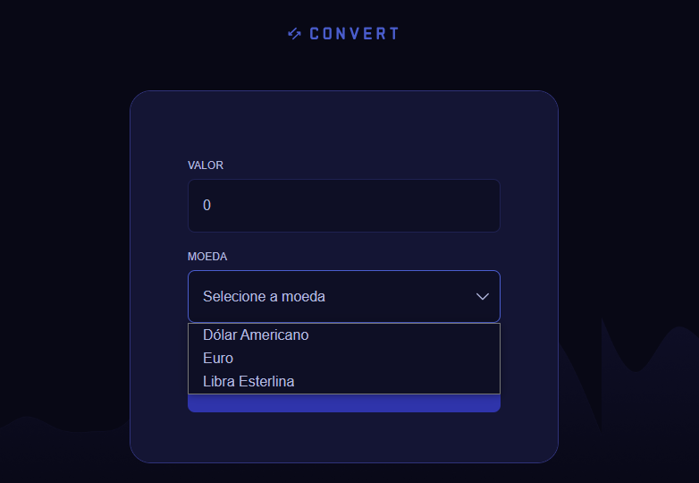
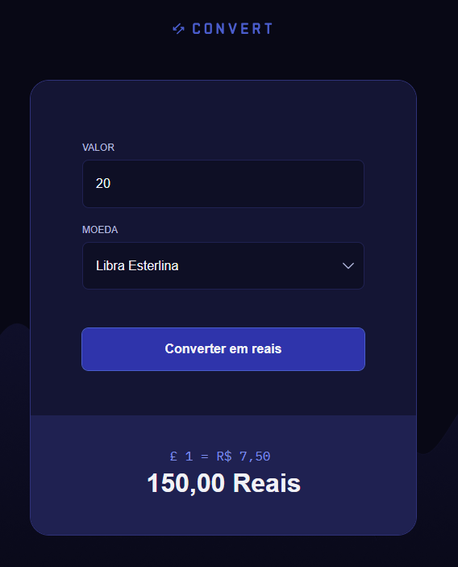

<h1 align="center"> Conversor de Moedas </h1>

  Projeto desenvolvido com o curso Fullstack da Rocketseat.  
  <strong>O principal objetivo deste projeto é aplicar os conceitos aprendidos em JavaScript.</strong>

  <a href="#-tecnologias">Tecnologias</a>&nbsp;&nbsp;&nbsp;|&nbsp;&nbsp;&nbsp;
  <a href="#-projeto">Projeto</a>&nbsp;&nbsp;&nbsp;

 

  
  
      
      

## 🚀 Tecnologias

Esse projeto foi desenvolvido com as seguintes tecnologias:

- Javascript
- HTML e CSS
- Git e Github
- Figma

## 💻 Projeto

Este projeto é um conversor de moedas. Converta os valores de reais para Dólar, Euro e Libra.

---

Feito com ♥ by May
